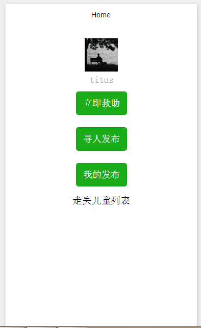
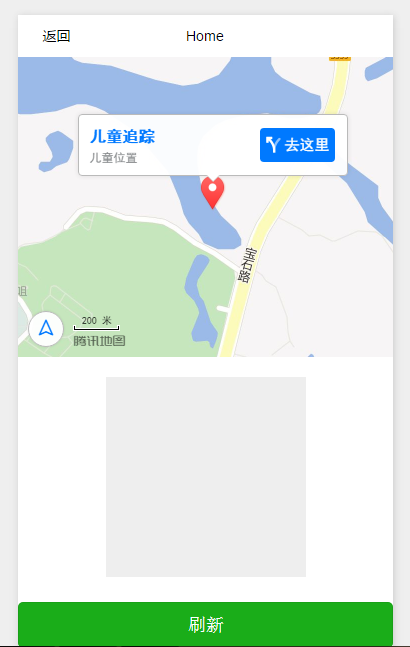

# tcloud-hackathon-GoHome

腾讯云马拉松参赛项目———回家，帮助走失儿童亲属和爱心人士寻找走失儿童。

## 主要功能

* 爱心人士（路人）可随时随地采集疑似走失儿童（如身份不明的乞讨儿童、车站周围孤身儿童）头像照片，同时上传自己身份信息和 GPS 定位信息到服务器后台，便于后续联系和实时的线下找回行动
* 走失儿童亲属上传儿童照片，后台进行比对返回数据库中最接近的儿童照片及 GPS 定位信息

## 服务器端

使用腾讯云主机，搭建 Python Flask 框架提供后台服务。使用到的组件有：

* 腾讯优图图像识别
* Leancloud 云空间

## 客户端

客户端采用微信小程序，利用小程序易于传播分发，自身带有登录系统的特点。代码结构为：

```
`-- tcloud-hackathon
    |-- app.js
    |-- app.json
    |-- app.wxss
    |-- assets
    |   |-- home-1.png
    |   `-- home-2.png
    |-- pages
    |   |-- index # 主页
    |   |   |-- index.js
    |   |   |-- index.wxml
    |   |   `-- index.wxss
    |   |-- map # 地图定位页面
    |   |   |-- map.js
    |   |   |-- map.json
    |   |   |-- map.wxml
    |   |   `-- map.wxss
    |   `-- posts # 发布页面
    |       |-- posts.js
    |       |-- posts.json
    |       |-- posts.wxml
    |       `-- posts.wxss
    |-- README.md
    `-- utils
        |-- av-weapp.js # LeanCloud API
        `-- util.js
```

## Demo



